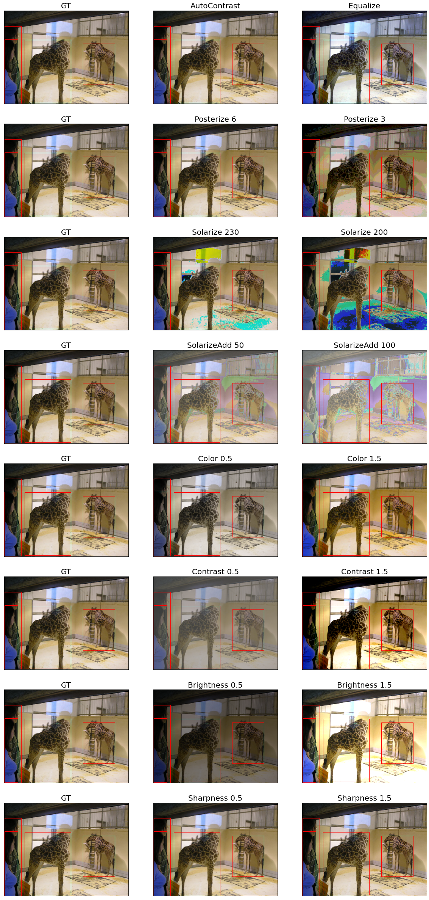
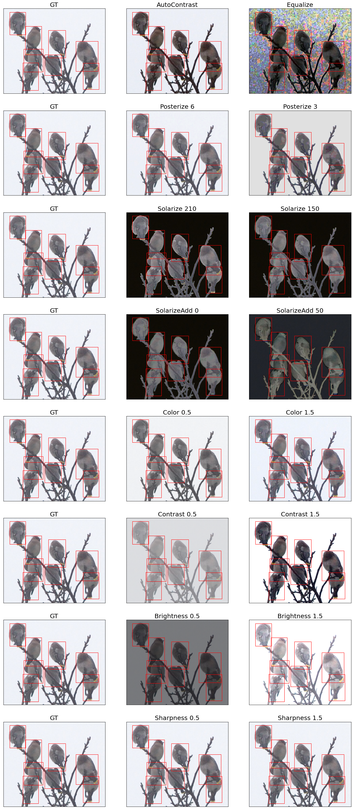
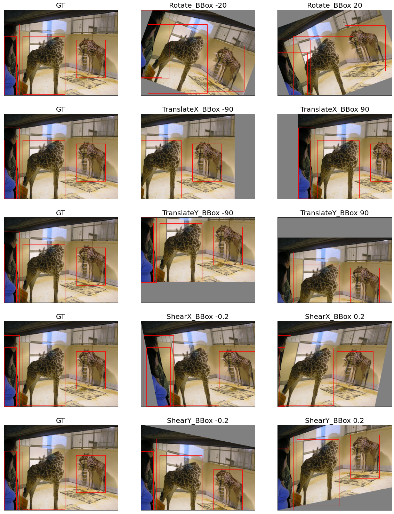
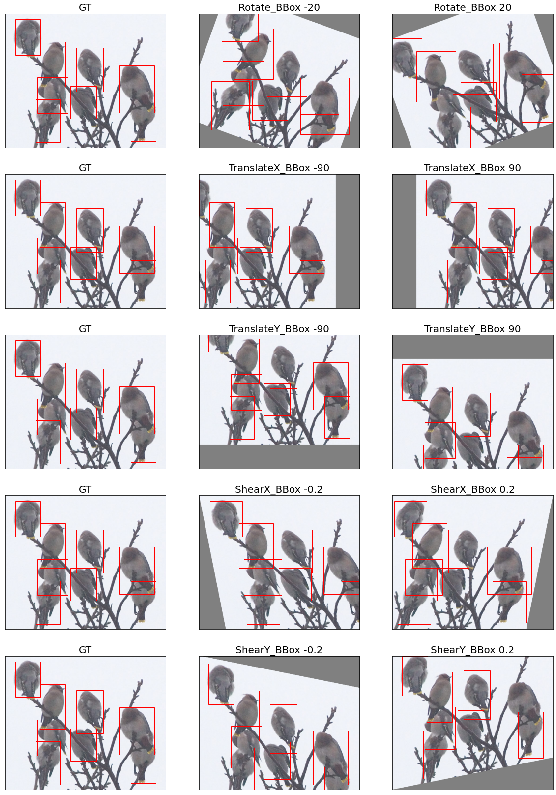
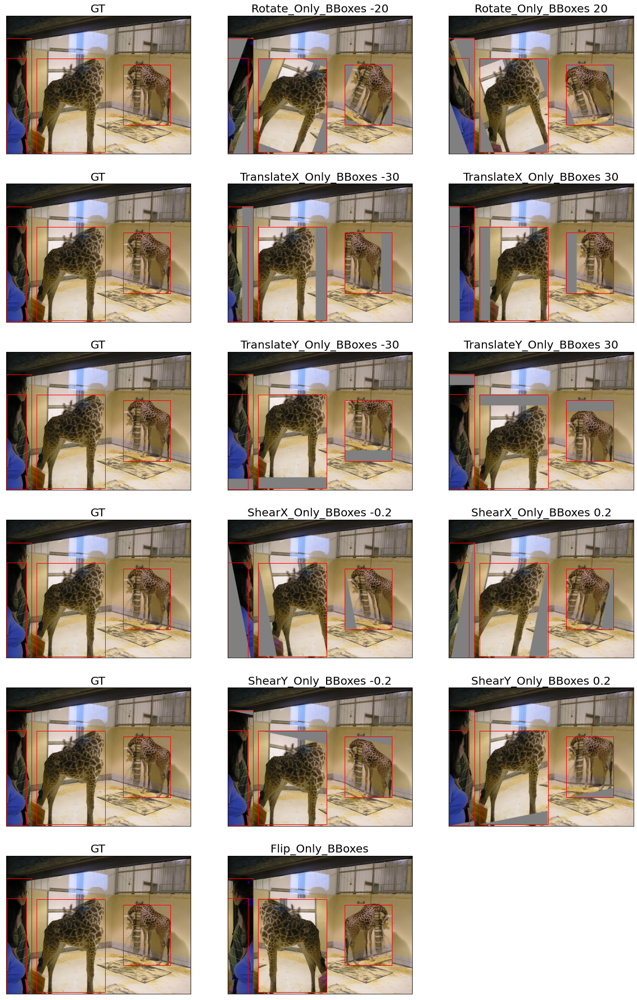
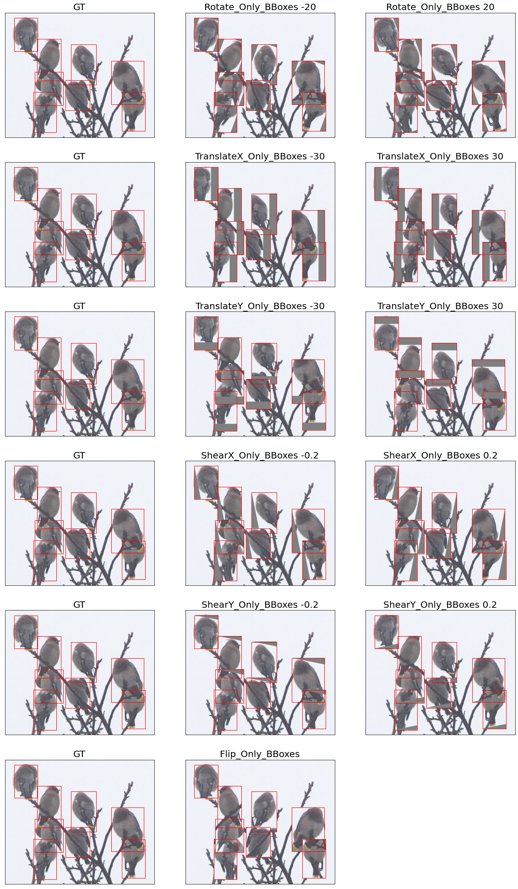
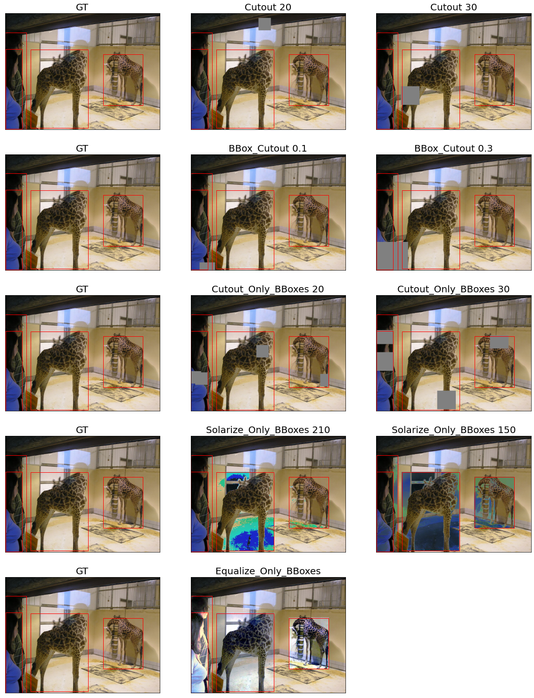
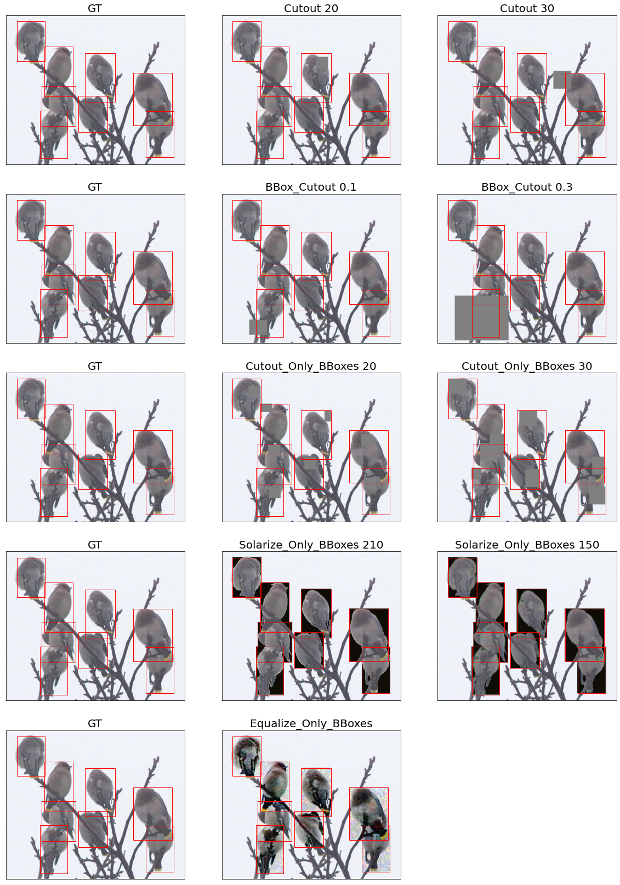
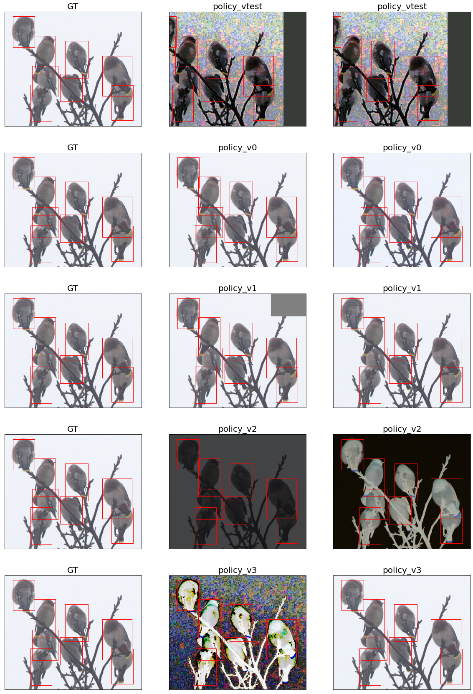
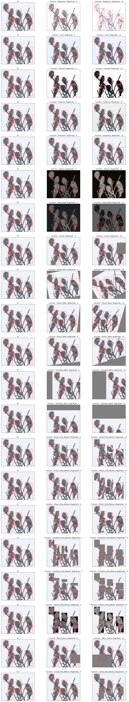

# AutoAugment for Detection Implementation with Pytorch
- Unofficial implementation of the paper *Learning Data Augmentation Strategies for Object Detection*


## 0. Develop Environment
```
Docker Image
- pytorch/pytorch:1.8.1-cuda11.1-cudnn8-devel
```
- Using Single GPU


## 1. Implementation Details
- augmentation.py : augmentation class with probability included
- dataset.py : COCO pytorch dataset
- functional.py : augmentation functions for augmentation class
- policy.py : augmentation policy v0, v1, v2, v3, vtest
- Visualize - Bounding Box Geometric Augmentation.ipynb : experiments of bounding box geometric augmentation
- Visualize - Color Augmentation.ipynb : experiments of color augmentation
- Visualize - Geometric Augmentation.ipynb : experiments of geometric augmentation
- Visualize - Magnitude Check.ipynb : experiments for checking Magnitude is right
- Visualize - Other Augmentation.ipynb : experiments of left augmentation
- Visualize - Policy.ipynb : experiments of policy
- Details
  * range are different so just followed the official code not the paper
  * some of the range are fixed cause of mismatch with magnitude
    * range 0.1 ~ 1.9 for color operation (Color, Contrast, Brightness, Sharpness)
    * but 1 is the default (original image)
    * so in this repo, I code like below
      * instead using 0.1 ~ 1.9, use 0 ~ 0.9 with random change (0.5 probability)
      * e.g.) 0.9 was chosen randomly minus the value (0.9 or -0.9) and add with 1 (1.9 or 0.1)
  * do not use numpy nor opencv for speed and preventing version crashes
  * similar design pattern following torchvision transforms code
  * some of the codes can be improved but not considered in this repo (e.g. TranslateX_Only_BBoxes - translate considering bbox size not fixed pixel)


## 2. Results
#### 2.1. Color Augmentation



#### 2.2. Geometric Augmentation



#### 2.3. Bounding Box Augmentation



#### 2.4. Other Augmentation



#### 2.5. Policy



#### 2.6. Magnitude




## 3. Reference
- Learning Data Augmentation Strategies for Object Detection [[paper]](https://arxiv.org/pdf/1906.11172.pdf) [[official code]](https://github.com/tensorflow/tpu/blob/master/models/official/detection/utils/autoaugment_utils.py)
