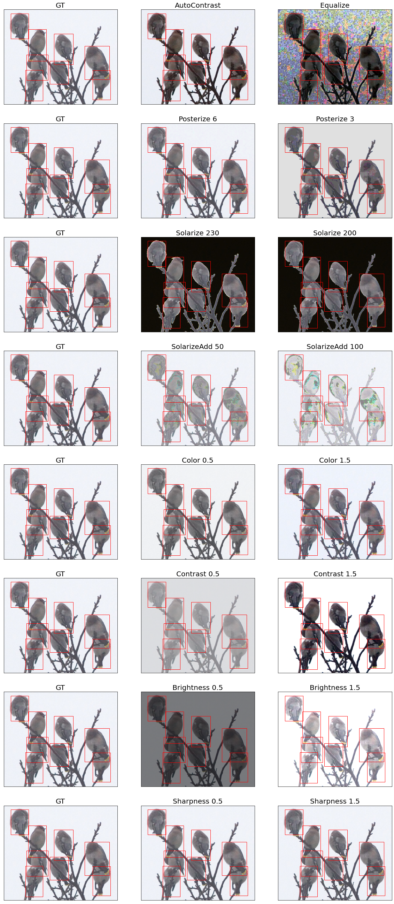
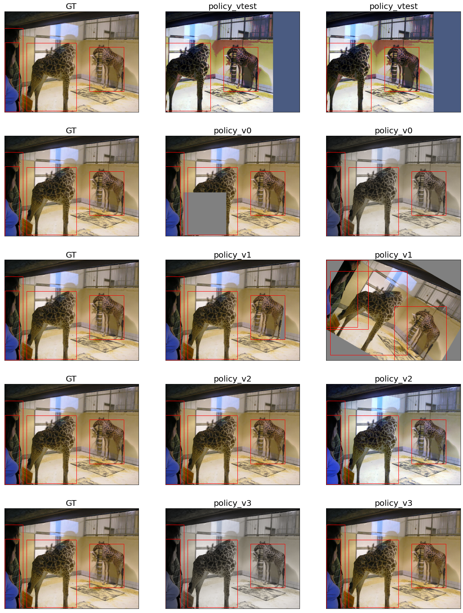

# AutoAugment for Detection Implementation with Pytorch
- Unofficial implementation of the paper *Learning Data Augmentation Strategies for Object Detection*


## 0. Develop Environment
```
Docker Image
- pytorch/pytorch:1.8.1-cuda11.1-cudnn8-devel
```
- Using Single GPU


## 1. Implementation Details
- augmentation.py : augmentation class with probability included
- dataset.py : COCO pytorch dataset
- functional.py : augmentation functions for augmentation class
- policy.py : augmentation policy v0, v1, v2, v3, vtest
- Visualize - Bounding Box Geometric Augmentation.ipynb : experiments of bounding box geometric augmentation
- Visualize - Color Augmentation.ipynb : experiments of color augmentation
- Visualize - Geometric Augmentation.ipynb : experiments of geometric augmentation
- Visualize - Other Augmentation.ipynb : experiments of left augmentation
- Visualize - Policy.ipynb : experiments of policy
- Details
  * range are different so just followed the official code not the paper
  * do not use numpy nor opencv for speed and preventing version crashes
  * similar design pattern following torchvision transforms code


## 2. Results
#### 2.1. Color Augmentation



#### 2.2. Geometric Augmentation


#### 2.3. Bounding Box Augmentation


#### 2.4. Other Augmentation


#### 2.4. Policy



## 3. Reference
- Learning Data Augmentation Strategies for Object Detection [[paper]](https://arxiv.org/pdf/1906.11172.pdf) [[official code]](https://github.com/tensorflow/tpu/blob/master/models/official/detection/utils/autoaugment_utils.py)
